# Projet Fullstack — React + Node.js (Docker Compose)

[](https://www.docker.com/)

## 📝 Résumé

Ce dépôt contient une application Fullstack (Frontend React + Backend Node/Express) pensée pour être lancée facilement avec `docker-compose`. Le README couvre l'installation, le lancement en développement, la structure du projet, et une galerie d'images utiles pour le debugging.

---

## 📁 Arborescence principale

- [docker-compose.yml](docker-compose.yml)
- [backend](backend)
- [frontend](frontend)
- [images](images) — captures et captures d'erreurs utiles

---

## Prérequis

- Docker & Docker Compose installés
- Node.js (si vous lancez localement sans Docker)

---

## Démarrage (recommandé : Docker Compose)

1. Construire et lancer les services :

```bash
docker-compose up --build
```

2. Accéder au frontend (par défaut) : http://localhost:5173

3. API backend (exemple) : http://localhost:3000

---

## Démarrage en développement sans Docker

Backend :

```bash
cd backend
npm install
npm run dev
```

Frontend :

```bash
cd frontend
npm install
npm run dev
```

---

## Scripts utiles

- Backend : `npm run dev` (surveille `server.js`) — voir [backend/package.json](backend/package.json)
- Frontend : `npm run dev` (Vite) — voir [frontend/package.json](frontend/package.json)

---

## Section Images — Dépannage & captures

Les images présentes dans le dossier `images/` documentent des erreurs et corrections rencontrées pendant le développement. Elles peuvent aider à diagnostiquer des problèmes courants.

Galerie :

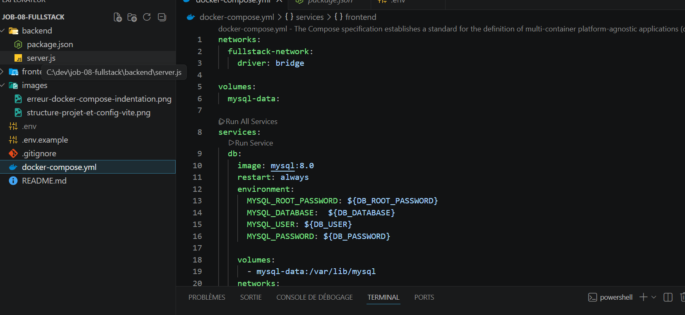

_Légende : Diagramme extrait du fichier `docker-compose.yml` montrant les services (frontend, backend, db), les ports exposés et les volumes. Utile pour visualiser l'architecture et repérer les conflits de ports._

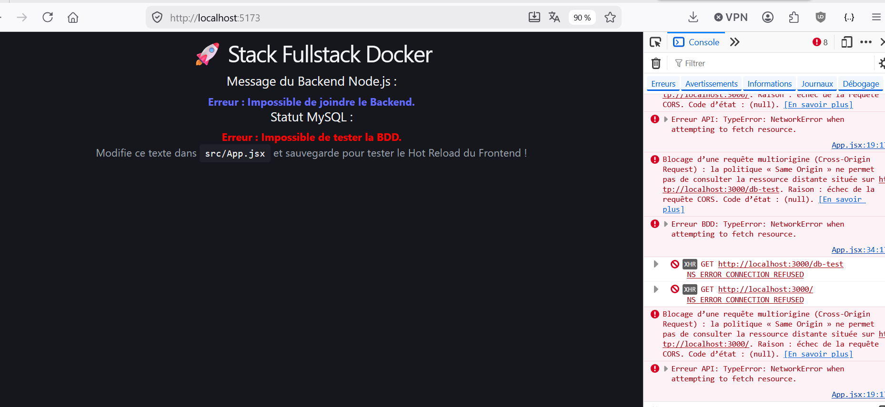

_Légende : Erreur liée au port 5173 (Vite). Cause fréquente : le serveur de développement Vite n'est pas démarré ou le port est déjà utilisé. Vérifier `npm run dev` et libérer le port si nécessaire._

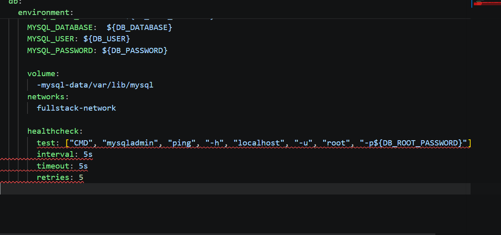

_Légende : Erreur d'indentation dans `docker-compose.yml`. YAML est sensible aux espaces — corriger l'alignement des clés (services, volumes) pour résoudre l'erreur._

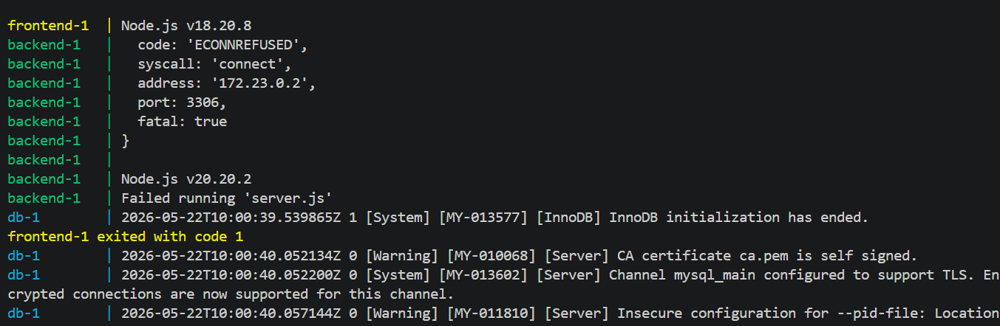

_Légende : Erreur côté frontend affichée dans la console du navigateur ou dans Vite. Vérifier les messages de compilation, les importations invalides et la compatibilité des versions React/Vite._

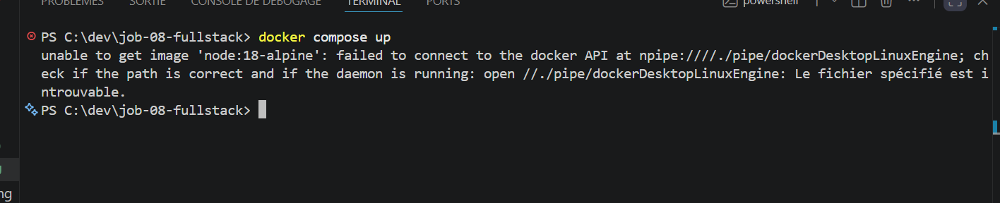

_Légende : Échec lors de `docker-compose up` (build ou runtime). Inspecter la sortie complète du build pour identifier l'étape qui a échoué (Dépendances manquantes, erreurs de Dockerfile, permissions)._

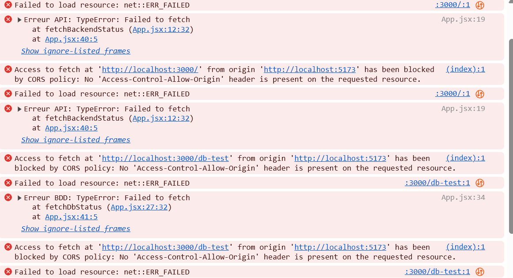

_Légende : Erreur CORS lors d'appels API cross-origin. Solution : activer `cors()` dans Express (backend) ou configurer un proxy dans `vite.config.js` pendant le développement._

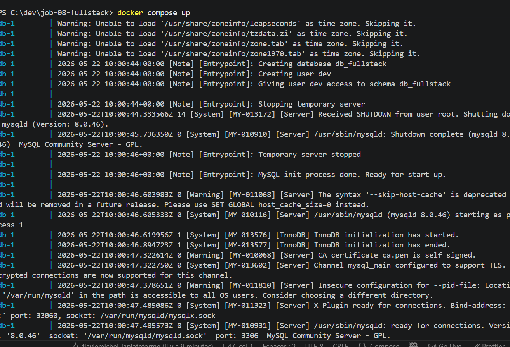

_Légende : Les conteneurs se lancent mais le frontend affiche une erreur à l'exécution. Vérifier que l'URL d'API est correcte et que le backend est joignable depuis le réseau Docker._

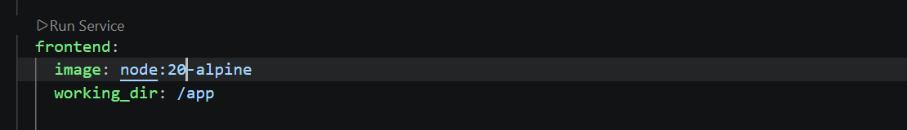

_Légende : Patch appliqué : remplacement de l'image Docker `node:18` par `node:20` pour résoudre des incompatibilités de dépendances ou des warnings liés à la version de Node._

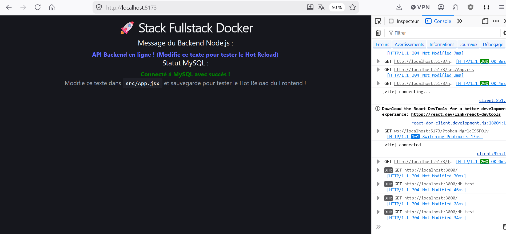

_Légende : Vérification après correction : captures montrant que le problème CORS et les versions de dépendances sont résolus et que les requêtes aboutissent correctement._

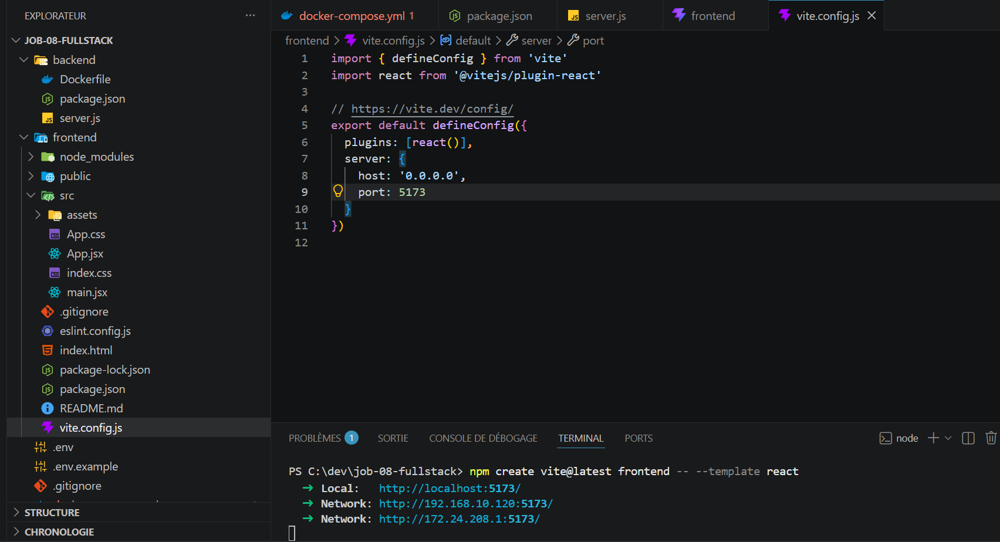

_Légende : Vue de l'arborescence du projet et extrait de `vite.config.js`. Montre les alias, le proxy et la configuration recommandée pour le développement local._

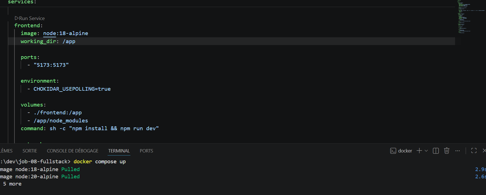

_Légende : Scénario de diagnostic : Docker Desktop arrêté mais erreurs persistantes. Actions recommandées : redémarrer Docker, supprimer containers/images orphelins, et vérifier l'état des volumes._

---

## Notes & conseils rapides

- Si le frontend ne se recharge pas, vérifiez la configuration de Vite et la console du navigateur.
- Pour les erreurs CORS, activez `cors` côté backend (le projet include la dépendance).
- Si Docker signale des erreurs au build, vérifiez l'état de Docker Desktop et les permissions.

---
